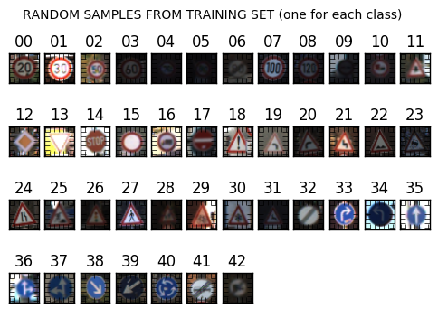
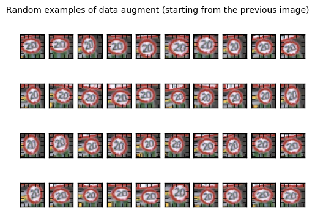

## Project: Build a Traffic Sign Recognition Program

### Overview

In this project, you will use what you've learned about deep neural networks and convolutional neural networks to classify traffic signs. You will train a model so it can decode traffic signs from natural images by using the [German Traffic Sign Dataset](http://benchmark.ini.rub.de/?section=gtsrb&subsection=dataset). After the model is trained, you will then test your model program on new images of traffic signs you find on the web, or, if you're feeling adventurous pictures of traffic signs you find locally!

### Data exploration
There are 42 classes in the dataset. Here is a example image of each class.

 
 
### Data augmentation
Keras has a very handy function `ImageDataGenerator(rotation_range=15., zoom_range=0.2,
                                   width_shift_range=0.1,
                                   height_shift_range=0.1)` which generate infinite images within the range of `rotation_range, zoom_range, width_shift_range and height_shift_range `. Here is the example of generated image.
 

### Architecture
#### Input
The my architecture accepts a 32x32x1 image as input, where 1 is the number of color channels. 

**Layer 1: Convolutional.** The output shape should be 29x29x64.

**Activation.** Relu.

**Pooling.** The output shape should be 15x15x64.

**Layer 2: Convolutional.** The output shape should be 13x13x128.

**Activation.** Relu.

**Pooling.** The output shape should be 7x7x128.

**Flatten.** Flatten the output shape of the final pooling layer and pooling layer2 and contancat two arrays such that it's 1D instead of 3D. The easiest way to do is by using `tf.contrib.layers.flatten`, which is already imported for you.

**Layer 3: Fully Connected.** This should have 7x7x128 + 15x15x64 outputs.

**Activation.** Relu.

**Layer 4: Fully Connected.** This should have 64 outputs.

**Dropout.** 

**Layer 5: Fully Connected (Logits).** This should have 43 outputs.

### Hyperparameters
Epoch:20

optimizer: AdamOptimizer

batch size: 128

Learning rate: 0.001

### Results
99.5% accuracy on testing set.

### Test on new dataset
I collect some images from Internet and here is the prediction distribution.
 

