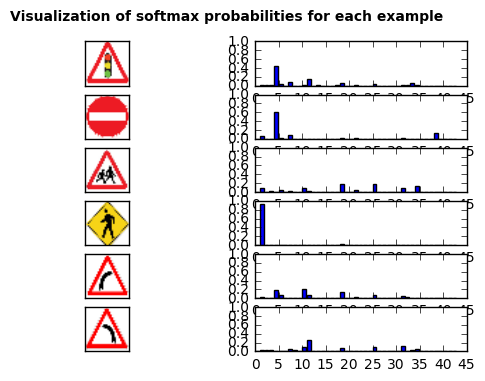
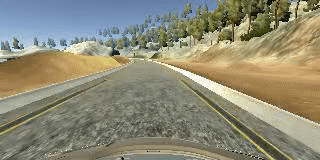
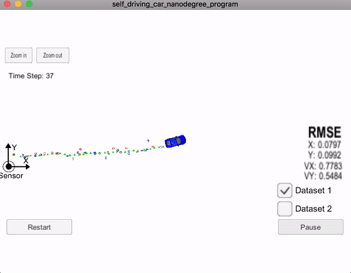
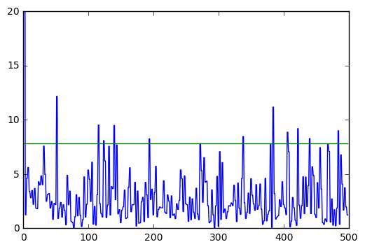
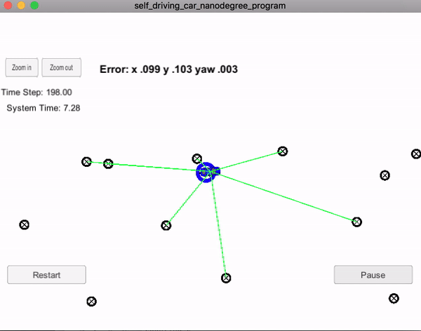
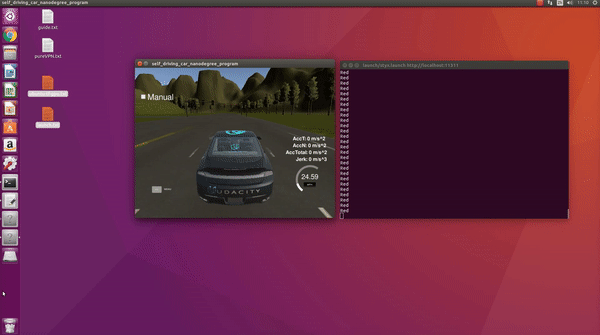
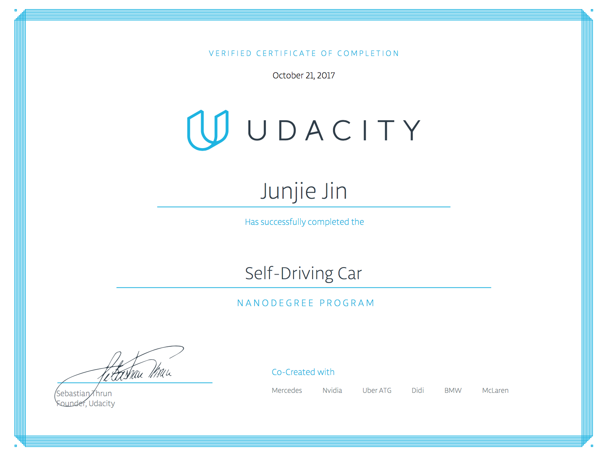

# self-driving-car

In this repository I will share the **source code** of all the projects of **[Udacity Self-Driving Car Engineer Nanodegree](https://www.udacity.com/course/self-driving-car-engineer-nanodegree--nd013).**

## Overview

<table style="width:100%">
  <tr>
    <th>

           
            P1: Basic Lane Finding
            <a href="./Project_1_basic_lane_finding" name="p1_code">(code)</a>
      

    </th>
    <th>

           
            P2: Traffic Signs
            <a href="./Project_2_traffic_sign_classifier" name="p2_code">(code)</a>
       

    </th>
    <th>

           
            P3: Behavioral Cloning
            <a href="./Project_3_behavioral_cloning" name="p3_code">(code)</a>
        

    </th>
    <th>

           
            P4: Adv. Lane Finding
            <a href="./Project_4_advanced_lane_finding" name="p4_code">(code)</a>
        

    </th>
  </tr>
  <tr>
    <th>

           
            P5: Vehicle Detection
            <a href="./Project_5_vehicle_detection" name="p5_code">(code)</a>
        

    </th>
    <th>

           
            P6: Extended Kalman Filter
            <a href="./Project_6_ExtendedKalman_filter" name="p6_code">(code)</a>
      

    </th>
    <th>

           
            P7: Unsc. Kalman Filter 
            <a href="./Project_7_unscented_kalman_filter" name="p7_code">(code)</a>
      

    </th>
    <th>

           
            P8: Kidnapped Vehicle 
            <a href="./Project_8_kidnapped_vehicle" name="p8_code">(code)</a>
      

    </th>
  </tr>
  <tr>
  	<th>

           
            P9: PID Control 
            <a href="./Project_9_PID_control" name="p9_code">(code)</a>
      

    </th>
    <th>

           
            P10: Model Predictive Control
            <a href="./Project_10_MPC_control" name="p10_code">(code)</a>
      

    </th>
    <th>

           
            P11: Path Planning
            <a href="./Project_11_Path_planning" name="p11_code">(code)</a>
      

    </th>
    <th>

           
            P12: Semantic Segmentation
            <a href="./Project_12_Semantic Segmentation" name="p12_code">(code)</a>
      

    </th>
  </tr>
  <tr>
    <th>

           
            CAPSTONE: System Integration
            <a href="./P13_System_Integration" name="p13_code">(code)</a>
      

    </th>
  </tr>

</table>

## Table of Contents

#### [P1 - Detecting Lane Lines (basic)](Project_1_basic_lane_finding)
 - **Summary:** Detected highway lane lines on a video stream. Used OpencV image analysis techniques to identify lines, including Hough Transforms and Canny edge detection.
 - **Keywords:** Computer Vision
 
#### [P2 - Traffic Sign Classification](Project_2_traffic_sign_classifier)
 - **Summary:** Built and trained a deep neural network to classify traffic signs, using TensorFlow. Experimented with different network architectures. Performed image pre-processing and validation to guard against overfitting.
 - **Keywords:** Deep Learning, TensorFlow, Computer Vision
 
#### [P3 - Behavioral Cloning](Project_3_behavioral_cloning)
 - **Summary:** Built and trained a convolutional neural network for end-to-end driving in a simulator, using TensorFlow and Keras. Used optimization techniques such as regularization and dropout to generalize the network for driving on multiple tracks.
 - **Keywords:** Deep Learning, Keras, Convolutional Neural Networks

#### [P4 - Advanced Lane Finding](Project_4_advanced_lane_finding)
 - **Summary:** Built an advanced lane-finding algorithm using distortion correction, image rectification, color transforms, and gradient thresholding. Identified lane curvature and vehicle displacement. Overcame environmental challenges such as shadows and pavement changes.
 - **Keywords:** Computer Vision, OpenCV

#### [P5 - Vehicle Detection](Project_5_vehicle_detection)
 - **Summary:** Built an advanced vehicle detection algorithm using recently proposed [SSD deep network](https://arxiv.org/pdf/1512.02325.pdf) for detection. This the network performs detection and classification in a single pass, and natively goes in GPU, which is faster then CPU. Also the network outputs a confidence level along with the coordinates of the bounding box, so we can decide the tradeoff precision and recall just by tuning the confidence level we want.
 - **Keywords:** Computer Vision, OpenCV, CNN, SSD

#### [P6 - Extended Kalman Filter](Project_6_ExtendedKalman_filter)
 - **Summary:** Extended Kalman Filter fuses radar and lidar together to indirectly get infornation of object of interest in the environment. The State Transition Matrix is used to represent the position and velocity in 2D world. The accuracy is measured by RMSE (0.0651648, 0.0605379, 0.533212, 0.544193) for (px, py, vx, vy).
 - **Keywords:** C++, Extended Kalman Filter, Sensor Fusion, Radar, Lidar

#### [P7 - Unscented Kalman Filter](Project_7_unscented_kalman_filter )
 - **Summary:** Instead of calculating Jacobian Matrix (implemented in P6) every time new data is reveived, which is expensive and slow, we use Sigma Point to estimate the mean and varience of each state. This achieved a relatively high positional and volocity accuracy.
 - **Keywords:** C++, Unscented Kalman Filter, Sensor Fusion, Radar, Lidar

#### [P8 - Kidnapped Vehicle](Project_8_kidnapped_vehicle)
 - **Summary:** Particle Filters are introduced as the tool for localization. This method uses thousands of particles to update the believe of vehicle location. Whenever new radar/lidar data with landmark arrived, the weight of each particle is recalculated and particles are resampled with replacement.
 - **Keywords:** Particle Filters, C++

#### [P9 - PID Control](Project_9_PID_control)
 - **Summary:** Built  a PID controller in C++ to maneuver the vehicle around the track. "Twiddle" technique is used as a tool to find the optimum proportional, differential and integral factors.
 - **Keywords:** PID control, C++

#### [P10 - MPC Control](Project_10_MPC_control)
 - **Summary:** Built a Model Predictive Controller in C++ to maneuver the vehicle around the track. Vehicle's Kinematic Model is built in 2D world and cost function is introduced to make sure vehicle follow certain requirements(speed, accuracy, acceleration).
 - **Keywords:** MPC control, C++

#### [P11 - Path Planning](Project_11_Path_planning)
 - **Summary:** Based on sensor fusion data, the vehicle's actions(keep current lane, slow down, constant speed, speed up, lane change left, lane change right) are governed by finate state machine. Safety is the priority while keep the speed as close to the target speed(50MPH) as possible.
 - **Keywords:** Perception, C++

#### [P12 - Semantic Segmentation](Project_12_Semantic_Segmentation)
 - **Summary:** Built  an Semantic Segmentation using Fully Convolutional Networks, which helps to derive valiable infornation in every pixel in the image rather than just a slicing sections of bounding box.
 - **Keywords:** Fully Convolutional Networks, Scene Understanding.

#### [P13 - System Integration](P13_System_Integration)
 - **Summary:** Integrate all of the sub-moduls into a real self-driving-car. [Robotic operating system](http://www.ros.org/) is used to handle communication between sub-systems. Sub-system includes Waypoint Updater, drive by wire(DBW) control system, Traffic sign detector. This code is tested in REAL Udacity driving car!
 - **Keywords:** ROS, Image classification, PID control, DBW.
 

  

